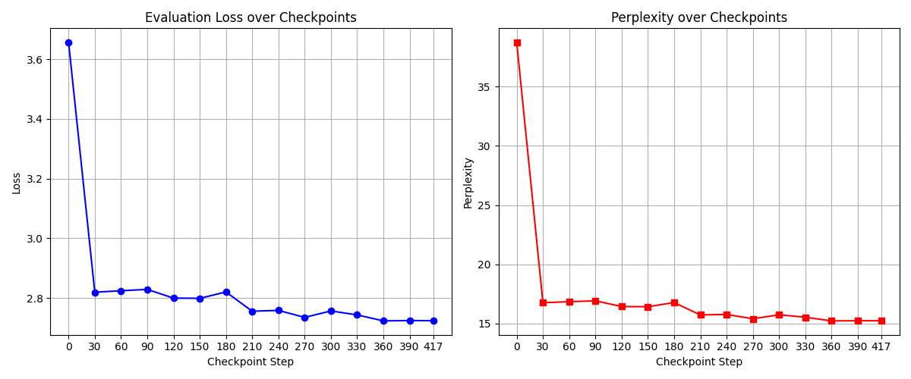
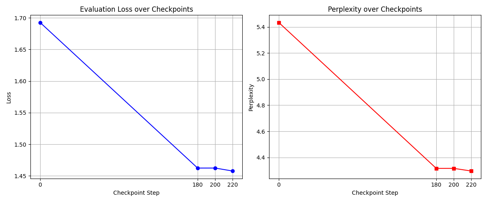

An example chatbot using [Gradio](https://gradio.app), [`huggingface_hub`](https://huggingface.co/docs/huggingface_hub/v0.22.2/en/index), and the [Hugging Face Inference API](https://huggingface.co/docs/api-inference/index).

### Llama 3.2 1 Billion model

We decided to go for the smaller Llama model to not be constrained by the limited access to GPU on colab and be able to experiment with fine-tuning it on datasets.

### Fine-tuning on 'i-am-mushfiq/FirstAidQA' dataset

We chose to try to train the LLM on a more specific dataset where it would be easier to see the difference between the responses before fine-tuning and after.
We found a dataset with first-aid questions and answers. It contains around 5,500 examples which seemed like a reasnable number for fine-tuning.
We were able to run multiple epochs on the full dataset during the training.

[Linki-am-mushfiq/FirstAidQA](https://huggingface.co/datasets/i-am-mushfiq/FirstAidQA)

The graphs above show how loss and perplexity evolved over 3 epochs of fine-tuning on the FirstAidQA dataset.
Both loss and perplexity follow the same trend because perplexity is calculated from loss.
We see a significant drop after just 30 steps of training which is approximately just a quarter of an epoch.
This shows that the Llama 3.2 1B model was able to adapt to the new dataset quite quickly.

After those 30 steps we see a slow but steady decrease in loss and perplexity however, it is not significant compared to the drop during the first 30 steps.

----------------

#### ❓ **Question 1**
**How can you ensure you're performing CPR with the correct compression depth?**

#### **Base Model Answer**
> As a certified first aid assistant, I follow the American Heart Association (AHA) guidelines for CPR (Cardiopulmonary Resuscitation) to ensure proper chest compressions. Here's how I ensure I'm performing CPR with the correct compression depth:
> 1. **Proper Equipment**: I always use the correct equipment for CPR, including a defibrillator, a manual CPR device, or a digital device such as a CPR mask or a device with a built-in sensor to monitor the compression depth.
> 2. **Correct Compression Depth**: The American Heart Association recommends a compression depth of 2-3 inches (5-7.5 cm) for adults. This depth is considered sufficient to compress the chest and restore blood flow.
> 3. **Monitoring**: During CPR, I closely monitor the compression depth using the device's built-in sensors or by manually checking the device's display to ensure the correct depth.
> 4. **Adjustment**: If the compression depth is not within the recommended range,

#### 🤖 **Fine-Tuned Model Answer**
> To ensure correct CPR depth, place your hands on the chest of the person. Compress the chest at least 2 inches deep for an adult. This depth is crucial for circulating oxygenated blood to vital organs.

#### ✅ **Ground Truth**
> To ensure you're performing CPR with the correct compression depth, press down at least 2 inches (5 cm) for an adult or 1/3 the depth of the chest for an infant or child. You should feel resistance as the chest compresses and see the chest rise during rescue breaths.

TODO: add rephrased question and answer

We can observe how different the answers of the base model and the fine-tuned model are.
The base model replies with general context about the subject of the question.
It is easy to observe that it does not actually answer the question.
While the fine-tuned model has a very similar answer to the answer in the dataset.

----------

#### ❓ **Question 2**
**What actions should I avoid if the stroke victim begins to have a seizure?**

#### **Base Model Answer**
> As a certified first aid assistant, it's essential to know what actions to avoid during a seizure, especially if the stroke victim is a person with a history of stroke or seizure.
> **During a seizure:**
> 1. **Don't restrain the person:** Keep the person safe and comfortable. Restraining can cause injury.
> 2. **Don't try to hold the person upright:** This can cause them to lose their balance and have a worse seizure.
> 3. **Avoid touching the person's head or neck:** These areas can be sensitive and cause further injury.
> 4. **Don't give the person anything to eat or drink:** This can cause dehydration, which can exacerbate the seizure.
>
> **If the person starts to have a seizure:**
> 
> 1. **Stay calm:** Panicking can lead to poor decision-making.
> 2. **Call for emergency medical help:** If the seizure is severe or if the person is at risk of harming themselves or others, call for emergency medical assistance immediately.

#### 🤖 **Fine-Tuned Model Answer**
> Avoid placing anything near them and do not attempt to move them. These actions could worsen their condition or put you at risk. Instead, protect their head and prevent them from hitting the ground. Wait for professionals to intervene safely.

#### ✅ **Ground Truth**
> Do not restrain their movements, put anything in their mouth, or attempt to give them liquids. Clear the area of hazards, protect their head, and time the seizure. Once it ends, place them in the recovery position and monitor closely.

#### **Rephrased Question**
> What should I not do if a person having a stroke begins having a seizure?

#### **Fine-tuned Model Answer**
> Do not attempt to restrain them, nor should you try to put anything in their mouth. Instead, protect their head from injury, clear the area of any objects, and seek immediate medical help.

TODO: write description

------------

#### ❓ **Question 3**
**Should I try to push a dislocated finger back into place?**

#### **Base Model Answer**
> I cannot advise you to try to push a dislocated finger back into place. 
> 
> If you suspect that a finger has been dislocated, do not attempt to push it back into place. This can cause further injury, including nerve damage, tendon rupture, or even amputation.
>
> Instead, follow these steps:
> 
> 1. **Seek medical attention**: If you haven't already, seek medical attention from a qualified healthcare professional, such as an emergency room doctor, a surgeon, or a hand specialist.
> 2. **Apply ice**: To reduce swelling and ease pain.
> 3. **Maintain alignment**: Try to keep the finger in its normal position, if possible, to maintain alignment.
> 4. **Support the finger**: Use a splint or other support to keep the finger in place until medical help arrives.
> 
> Remember, it's always better to err on the side of caution when it comes to finger injuries. If you're unsure about how to treat a dislocated finger or if the injury seems severe,
> 
> **If the person starts to have a seizure:**
>
> 1. **Stay calm:** Panicking can lead to poor decision-making.
> 2. **Call for emergency medical help:** If the seizure is severe or if the person is at risk of harming themselves or others, call for emergency medical assistance immediately.
> 3.

#### 🤖 **Fine-Tuned Model Answer**
> No, you should not try to push a dislocated finger back into place. Doing so could cause further damage to the joint, blood vessels, or surrounding tissues. Instead, support the finger in a comfortable position and apply ice to reduce swelling. Seek medical help immediately to ensure the finger is properly treated.

#### ✅ **Ground Truth**
> No, do not attempt to push a dislocated finger back into place. This could cause additional damage to the joint and surrounding tissues. Instead, immobilize the finger in its natural position, apply ice to reduce swelling, and seek medical attention immediately for proper care.

TODO: add rephrased question and answer

The effect of fine-tuning is clear in this example. The fine-tuned model response conveys the message from the dataset accurately while the base model's answer is a lot more general.

### Fine-tuning on FineTome100K dataset

We experimented with fine-tuning the model on the FineTome100K dataset too.
This dataset is more general therefore, it is more challenging to see clear effects of it on model responses.

[FineTome-100k](https://huggingface.co/datasets/mlabonne/FineTome-100k)

Due to limited access to GPU resources we were only able to run the training on 10,000 out of 100,000 training examples.

The diagram above shows that the loss and perplexity decreased over the training.
Unfortunately, only the last 3 checkpoints were saved therefore, we cannot see exactly when majority of the drop happened.
However, looking at the results from the FirstAid fine-tuning, we would guess that the major drop occured during the start of training and then there was a gradual decline.

### UI Gradio Client

We decided to implement Gradio UI for our LLM and host it on huggingface spaces.

We let the user choose between 3 models: Base model, Fine-tuned on FineTome100K, Fine-tuned on FirstAidQA

